# ☕ Coffee Shop API

A RESTful backend for a coffee shop management system, built using **Node.js**, **Express.js**, and **MySQL**.  
This API supports user authentication, address management, product CRUD operations, billing, and order processing.  
All endpoints are tested using **Postman**, and test case screenshots are included.

---

## 🚀 Features

- 🔐 User Registration and Login
- 📦 Add, Update, and Fetch Products
- 📬 Add and Update Address
- 📃 Billing and Order Management
- 🌐 MySQL Integration with Express
- 🧪 Postman-tested API endpoints
- ⚙️ Environment variable support via `.env`
- 🗂️ Clean folder structure

---

## 🛠️ Tech Stack

- **Backend**: Node.js, Express.js  
- **Database**: MySQL  
- **Testing**: Postman  
- **Config**: dotenv

---

## 📁 Folder Structure
-coffee-shop/
-├── testCases/ # Test screenshots
-│ ├── Authtest.png
-│ ├── add_update_addr.png
-│ ├── dataBaseconnectio.png
-│ ├── databaseConnectWeb.png
-│ ├── getAddr.png
-│ ├── orders.png
-│ ├── pachase_checkup.png
-│ ├── postman_login.png
-│ ├── postman_register.png
-│ ├── productADD_JSON.png
-│ └── viewBillingProducts.png
-├── routes/
-├── controllers/
-├── config/
-├── .env
-├── package.json
-└── README.md

---

## 📸 Test Case Screenshots

| Description                     | Image |
|---------------------------------|-------|
| ✅ Auth Test                    | 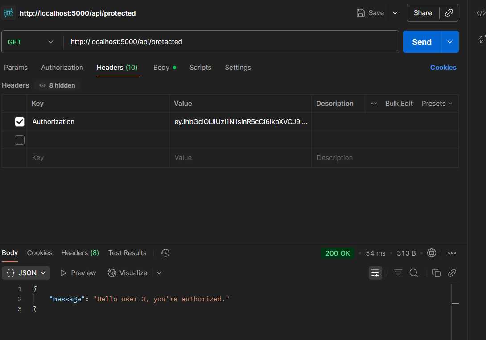 |
| 🏡 Add / Update Address         | 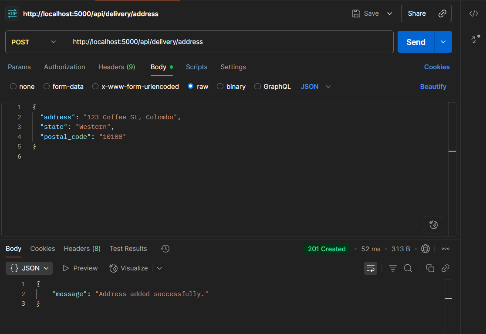 |
| 🔌 Database Connection (CLI)    | 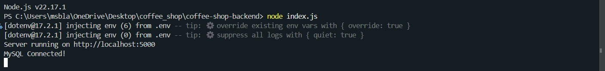 |
| 🌐 Database Connect (Web)       | 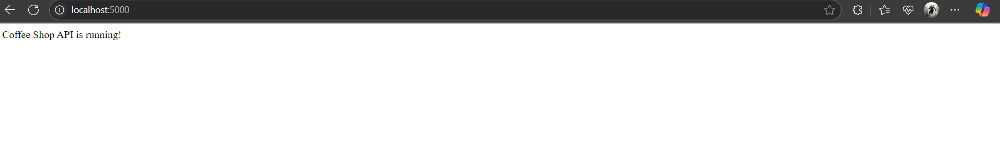 |
| 📍 Get Address                  | 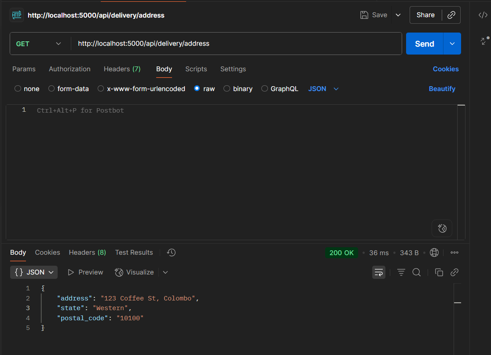 |
| 🧾 Orders API                   | 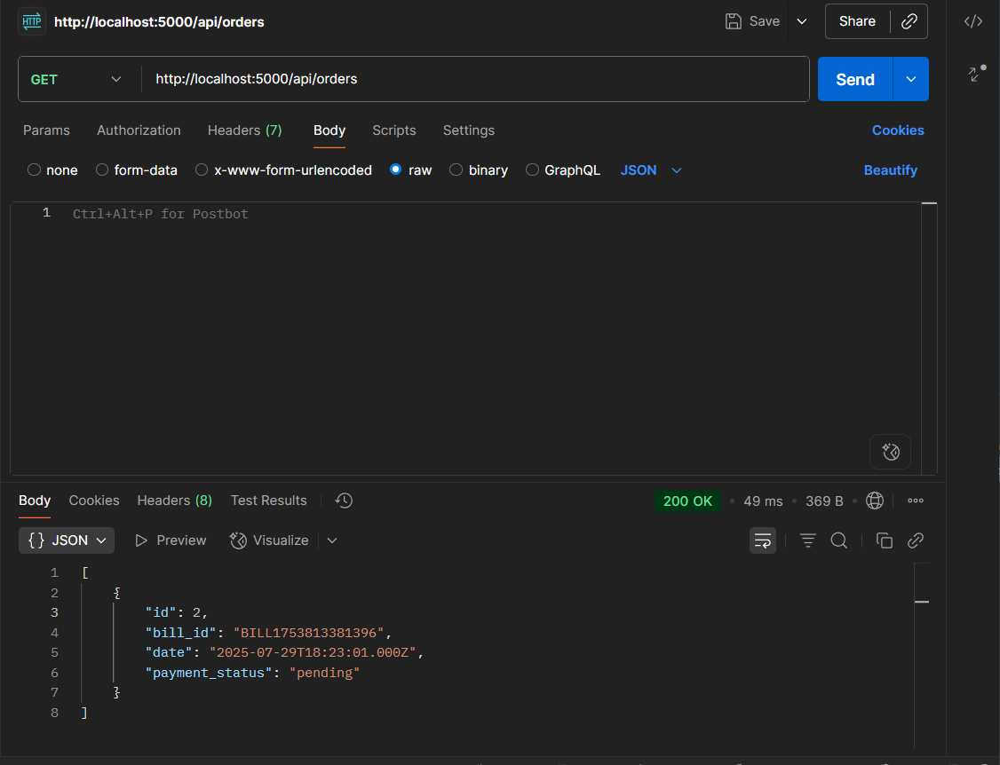 |
| 🛒 Purchase Checkup             | 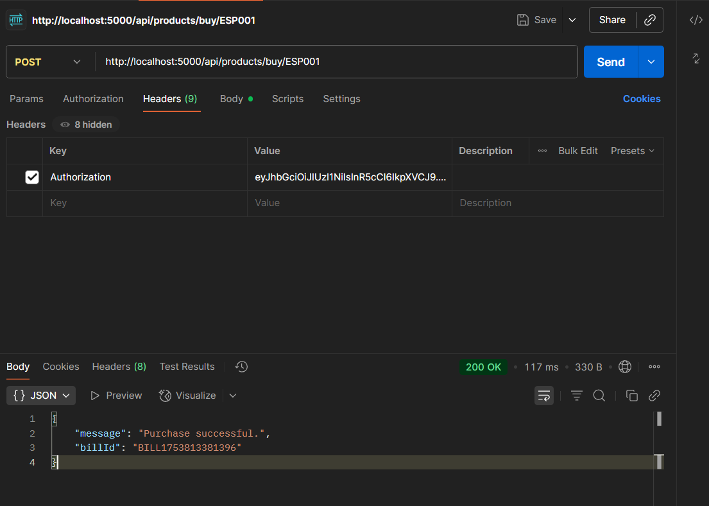 |
| 🔑 Postman - Login              | 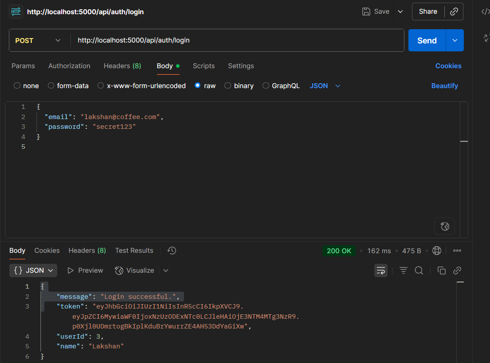 |
| 📝 Postman - Register           | 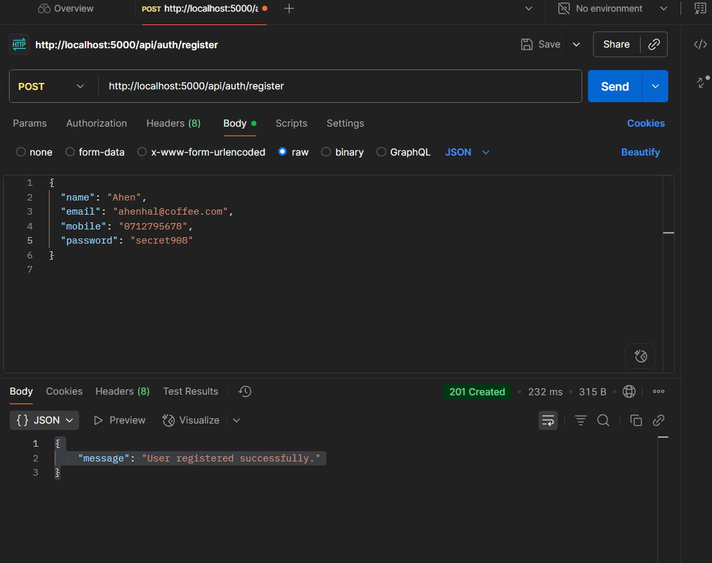 |
| 📦 Add Product (JSON)           | 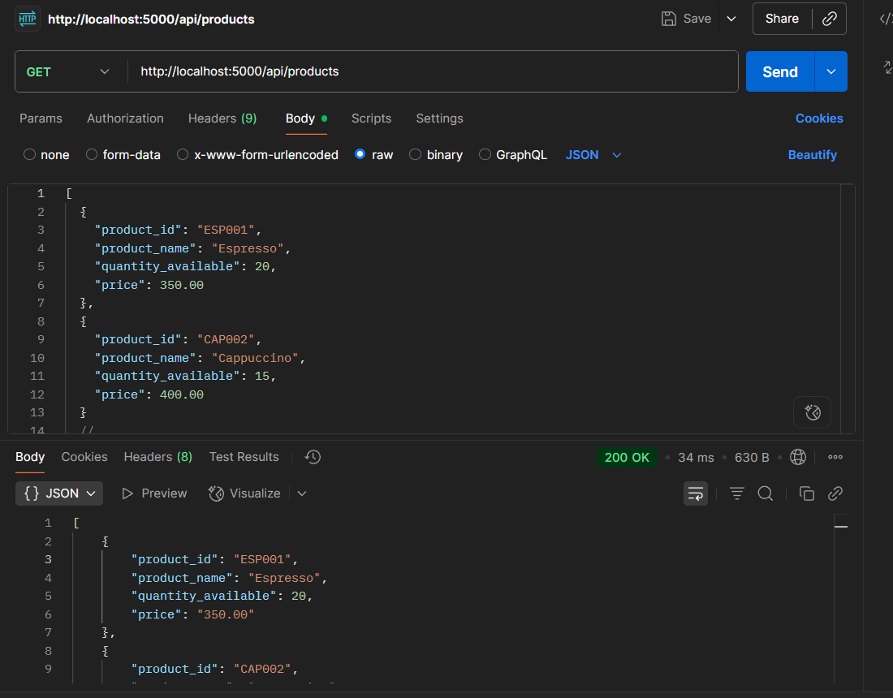 |
| 💳 View Billing Products        | 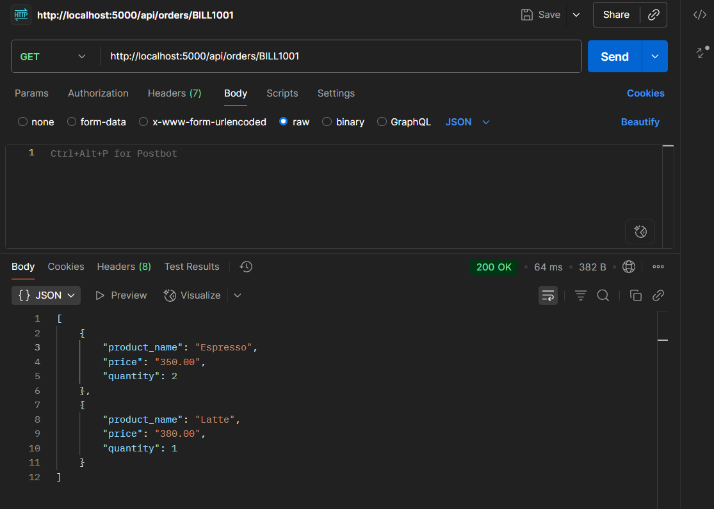 |

---

## ⚙️ Setup Instructions

1. **Clone the repo**  
   ```bash
   git clone https://github.com/your-username/coffee-shop.git
   cd coffee-shop
